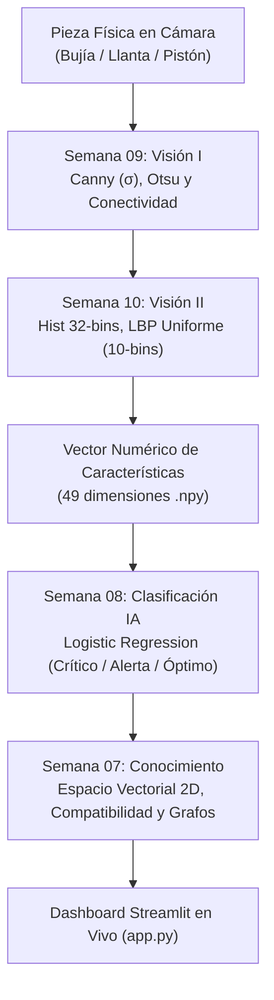

# 🎓 GUÍA MAESTRA DE SUSTENTACIÓN Y DEFENSA TÉCNICA (SEMANAS 07 A 10)
**Proyecto:** Sistema Inteligente de Monitoreo, Logística y Visión para Taller de Motos  
**Asignatura:** Inteligencia Artificial – 2026  
**Integrantes:** Erick Santiago Garcia Sanchez | Oscar David Gutierrez  

---

## 🧭 1. Visión Holística: ¿Cómo se conectan todas las semanas?

Si el profesor pregunta: *"¿Por qué hicieron estas semanas juntas y qué relación tienen?"*:
> **Respuesta Clave:**  
> *"Profesor, el objetivo del proyecto es cerrar la brecha entre el mundo físico del taller mecánico y la toma de decisiones algorítmica: mediante visión computacional (Semanas 9 y 10) transformamos las piezas mecánicas que entran por cámara en vectores numéricos de características; con ellos, los clasificadores de Machine Learning (Semana 8) y las estructuras de conocimiento (Semana 7) deciden alertas de inventario y compatibilidad sin intervención manual."*



---

## 📊 2. Semana 07: Representación del Conocimiento

### ¿Qué se hizo?
* **Modelado Vectorial de Inventario:** Cada repuesto $i$ es un vector $\vec{x}_i \in \mathbb{R}^2$:
  $$\vec{x}_i = [\text{Stock Actual}, \text{Días sin Rotación}]$$
* **Matriz de Compatibilidad:** Matriz binaria $M \in \{0, 1\}^{R \times M}$ que mapea cada repuesto contra las motocicletas del taller (Pulsar NS200, Yamaha FZ-16, AKT NKD 125, etc.).
* **Grafo de Conocimiento y Dependencias:** Grafo dirigido $G=(V, E)$ donde los nodos son tareas y componentes, y las aristas marcan precedencias mecánicas (ej. *Cambio de Pistón* requiere *Empaque de Culata* y *Aceite 4T*).

### 🎯 Simulacro de Preguntas / Modificaciones en Vivo:
* **¿Por qué representarlo como vector y no con diccionarios de Python?**  
  *Respuesta:* Los algoritmos de Machine Learning operan sobre matrices de diseño y álgebra lineal. Un vector permite medir distancias euclidianas, normas y productos internos. Un diccionario solo sirve para almacenamiento estático.
* **¿Qué pasa si el profesor añade una tercera variable al vector (ej. Precio)?**  
  *Respuesta:* El espacio pasa de $\mathbb{R}^2$ a $\mathbb{R}^3$. Las fronteras de decisión dejan de ser rectas 2D y se convierten en planos bidimensionales en 3 dimensiones.

---

## 🤖 3. Semana 08: Reconocimiento de Patrones y Machine Learning

### ¿Qué se hizo?
* **Clasificador:** Regresión Logística multiclase con `make_pipeline(StandardScaler(), LogisticRegression(multi_class='multinomial'))`.
* **Clases de Salida:**
  * `Clase 0 (Crítico)`: Stock $\le 5$ y rotación alta (riesgo de agotamiento).
  * `Clase 1 (Alerta)`: Stock medio o días sin rotación $> 60$ (capital estancado).
  * `Clase 2 (Óptimo)`: Stock equilibrado y flujo regular.

### 🎯 Simulacro de Preguntas / Modificaciones en Vivo:
* **¿Qué pasa si el profesor QUITA la línea `StandardScaler()`?**  
  *Respuesta:* El modelo pierde estabilidad y convergencia. La variable *Stock* va de 0 a 50 unidades, mientras que *Días sin Rotación* va de 0 a 180 días. Sin estandarizar, la función de costo calcula gradientes dominados exclusivamente por la variable de mayor escala (Días), sesgando el hiperplano y tardando más iteraciones en converger.
* **¿Por qué usar `multi_class='multinomial'` en vez de OvR (One-vs-Rest)?**  
  *Respuesta:* Porque `multinomial` utiliza la función Softmax global, estimando una distribución de probabilidad conjunta donde $\sum P(y=k) = 1.0$, a diferencia de OvR que entrena 3 modelos binarios desacoplados.

---

## 👁️ 4. Semana 09: Visión Computacional I (Canny, Otsu y Regiones)

### ¿Qué se hizo?
* **Detección de Bordes con Canny:**
  * **Etapa 1:** Suavizado Gaussiano con parámetro $\sigma$.
  * **Etapa 2:** Magnitud y ángulo de gradiente ($G_x, G_y$).
  * **Etapa 3:** Supresión de no-máximos (adelgaza el borde a 1 px de espesor).
  * **Etapa 4:** Histéresis de dos umbrales (alto y bajo).
* **Impacto Numérico de Sigma ($\sigma$):**
  * $\sigma = 1.0 \to 4,551\text{ px}$ de borde (capta rosca, electrodo, detalles finos y micro-sombras).
  * $\sigma = 2.0 \to 3,041\text{ px}$ de borde (punto de equilibrio óptimo).
  * $\sigma = 3.0 \to 1,912\text{ px}$ de borde (suavizado excesivo: borra la rosca del electrodo).
* **Segmentación de Otsu:**
  * Calcula el umbral $T^*$ que maximiza la varianza inter-clase: $\sigma_B^2(T) = \omega_0 \omega_1 (\mu_0 - \mu_1)^2$.
  * Para la bujía (`foto_bujia.jpg`): $T^* = 191$ (8-bit) o $0.748$ (float).
  * Máscara binaria: `mascara = img_gray < umbral_otsu` (cobertura del $6.84\%$).

### 🎯 Simulacro de Preguntas / Modificaciones en Vivo:
* **¿Qué pasa si el profesor cambia `img_gray < umbral_otsu` por `img_gray > umbral_otsu`?**  
  *Respuesta:* Se invierte la máscara. En lugar de aislar la pieza oscura (6.84% del área), se segmentaría el fondo blanco de la mesa de trabajo (93.16% del área), y todas las regiones analizadas serían fondo.
* **¿Por qué aumentan o disminuyen los píxeles de Canny al variar $\sigma$?**  
  *Respuesta:* $\sigma$ es la desviación estándar de la campana Gaussiana. A mayor $\sigma$, la campana es más ancha, promediando más píxeles vecinos y disipando los gradientes sutiles. Por eso, al subir $\sigma$ de 1 a 3, los píxeles de borde caen un 58%.

---

## 🔬 5. Semana 10: Histogramas, Regiones y Texturas LBP

### ¿Qué se hizo línea por línea?

#### 1. Histograma de Intensidad (32 Bins normalizado):
```python
hist_int, _ = np.histogram(img_gray.ravel(), bins=32, range=(0, 256), density=True)
```
* **¿Por qué 32 bins y no 256?** Compacta los niveles de gris en ventanas de 8 niveles ($256/32 = 8$). Evita vectores hiper-dispersos con sobreajuste.
* **¿Por qué `density=True`?** Normaliza para que la suma total sea 1.0 (densidad de probabilidad). Hace que el descriptor sea invariante a la resolución de la cámara.

#### 2. Etiquetado en 8-Conectividad y Filtro de Área:
```python
struct_8 = np.ones((3, 3), dtype=int)
lbl, num_crudas = ndi.label(mascara_binaria, structure=struct_8)
props = regionprops(lbl)
props_filtradas = [r for r in props if r.area >= 50]
```
* **8-conectividad:** Vecinos adyacentes en cruz y diagonales (matriz 3x3 de unos).
* **Filtro `r.area >= 50`:** Elimina el ruido impulsivo y virutas metálicas en la mesa.

#### 3. Patrón Binario Local (LBP) Uniforme:
```python
lbp = local_binary_pattern(img_gray, P=8, R=1, method='uniform')
hist_lbp, _ = np.histogram(lbp.ravel(), bins=10, range=(0, 10), density=True)
```
* **¿Por qué da 10 bins exactamente con $P=8$?**
  Un patrón es uniforme si tiene como máximo 2 transiciones de $0 \to 1$ o $1 \to 0$. Para 8 vecinos hay 58 patrones uniformes, que se agrupan en $P+1 = 9$ bins (micro-bordes, esquinas y superficies planas). Todos los demás patrones no uniformes (ruido de alta frecuencia y rugosidades complejas) van al bin 9 (el 10º bin). Total: $P + 2 = 10\text{ bins}$.
* **Significado de los Bins:**
  * `Bins 0 a 7`: Micro-bordes y esquinas direccionales.
  * `Bin 8`: Superficie homogénea plana (fondo blanco o metal pulido liso).
  * `Bin 9`: Ruido o micro-textura aperlada no uniforme.

#### 4. Vector de Características de 49 Dimensiones (`semana10_features.npy`):
$$\mathbf{v} = \underbrace{[7 \text{ métricas de regiones}]}_{\text{Morfometría}} \cup \underbrace{[32 \text{ bins de intensidad}]}_{\text{Filtro fotométrico}} \cup \underbrace{[10 \text{ bins LBP}]}_{\text{Textura local}} = \mathbf{49\text{ dimensiones}}$$

### 📈 Comparativa de Resultados del Taller:
| Característica | Bujía (`foto_bujia.jpg`) | Neumático / Llanta (`foto_llanta.jpg`) | Pistón (`foto_piston.jpg`) |
| :--- | :--- | :--- | :--- |
| **Umbral Otsu ($T^*$)** | **191** | **157** | **183** |
| **Cobertura en Imagen** | $6.82\%$ | $41.89\%$ | $30.26\%$ |
| **Regiones Conexas** | 22 crudas $\to$ **2 filtradas** | 30 crudas $\to$ **1 filtrada** | 152 crudas $\to$ **4 filtradas** |
| **Área Promedio** | $6,718\text{ px}$ | $128,466\text{ px}$ | $17,454\text{ px}$ |
| **LBP Bin 8 (Liso)** | **86.49%** (Pulido) | **55.93%** (Rugoso) | **50.06%** (Mecanizado) |
| **LBP Bins 0-7 (Microbordes)**| $6.84\%$ | **30.34%** ($4.4\times$ mayor) | $12.18\%$ |

> **Diferencia física clave:** La llanta presenta **4.4 veces más respuesta en los bins de microbordes de LBP** que la bujía debido al labrado profundo de la banda de rodadura y a la porosidad del caucho vulcanizado.

---

## 🛡️ 6. Caso de Estudio: Resiliencia ante Windows AppLocker

Si el profesor pregunta: *"¿Por qué usaron `scipy.ndimage.label` en lugar de `skimage.measure.label`?"*:
* **Causa técnica:** Windows Defender Application Control / AppLocker bloquea la carga de DLLs compiled en C/C++ de usuario (`_max_tree.cp314-win_amd64.pyd`) requeridas por `skimage.measure.label` y `reg.solidity`.
* **Solución de ingeniería:**
  1. Se implementó `scipy.ndimage.label(mask, structure=np.ones((3, 3)))`, el cual opera directamente en C estándar sin invocar `_max_tree` y manteniendo compatibilidad total con `regionprops()`.
  2. Para el cálculo de convexidad de regiones, se programó un fallback automático utilizando el algoritmo de convex hull de OpenCV (`cv2.convexHull()`), logrando una arquitectura 100% tolerante a restricciones del sistema operativo.

---

## 🖥️ 7. Comandos de Verificación Rápida

```powershell
# Ejecutar procesamiento de la Semana 9
py src/semana09_vision.py

# Ejecutar procesamiento y vectorización de la Semana 10
py src/semana10_texturas.py

# Lanzar Dashboard interactivo en Streamlit
py -m streamlit run app.py
```

